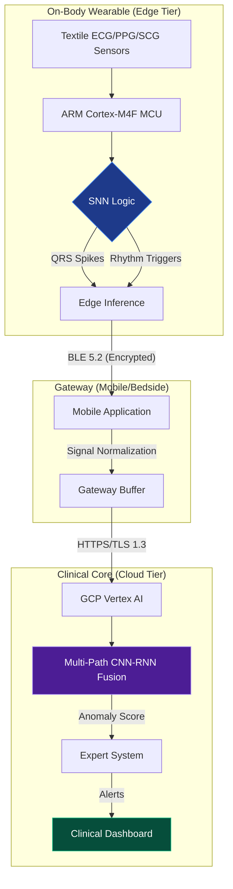
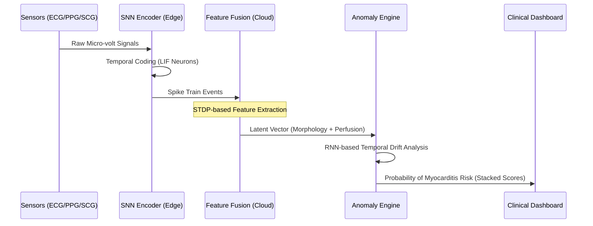

# HakilixM: Pediatric Cardiac Intelligence System

[](https://www.iso.org/standard/59752.html)
[](https://www.fda.gov/medical-devices/software-medical-device-samd)
[](#copyright)

**HakilixM** is a high-fidelity distributed monitoring system designed for early detection of pediatric myocarditis in patients under 5 years old. The system leverages a multi-tier neural architecture, combining ultra-low-power **Spiking Neural Networks (SNN)** on-body with heavyweight **CNN-RNN Fusion** in the cloud.

---

## 🏗 System Architecture

The system follows a distributed compute topology to balance battery longevity with clinical precision.



---

## 🚀 Getting Started (Local Development)

To run the HakilixM Intelligence Dashboard in a local environment, follow these steps:

### 1. Prerequisites
- **Node.js** (v18 or higher recommended)
- **NPM** or **Yarn**
- A valid **Gemini API Key** (for Neural Auditor features)

### 2. Installation
Clone the repository and install the required dependencies:
```bash
git clone https://github.com/hakilix/hakilixm-dashboard.git
cd hakilixm-dashboard
npm install
```

### 3. Environment Configuration
Create a `.env` file in the project root and add your API key. The application uses this key exclusively for the `analyzeRiskPattern` service.
```env
API_KEY=your_gemini_api_key_here
```

### 4. Launch
Run the development server:
```bash
npm start
```
The dashboard will be available at `http://localhost:3000`.

---

## 🧠 Neural Intelligence Pipeline

The **Anomaly Engine** processes synchronized physiological streams through a stacked contribution model.



---

## 📊 Feature Contributions

HakilixM provides transparency into its decision-making via **Explainable AI (XAI)** markers:
- **ECG Morphology Deviation:** Detecting R-peak damping or QRS widening.
- **PPG Perfusion Amplitude:** Real-time monitoring of cardiac output shifts.
- **SCG Mechanical Pattern:** Tracking contractility changes in the 10-50Hz band.

---

## ⚖️ Regulatory Traceability

The system is developed under a strict Design History File (DHF) structure:
1. **Design Inputs:** PRD-1.0 to PRD-5.0 (Clinical & Performance Requirements).
2. **Risk Management:** FMEA per ISO 14971; Pediatric Bio-compatibility analysis.
3. **Verification:** Traceability matrix linking every ML requirement to a Test Protocol.

---

## 🛡 Copyright

**Copyright © 2025 Hakilix Labs UK Ltd.**  
Proprietary and Confidential. Unauthorized distribution prohibited.

**Principal Investigator:** Musah Shaibu (MS3)  
**Contact:** research@hakilix.co.uk